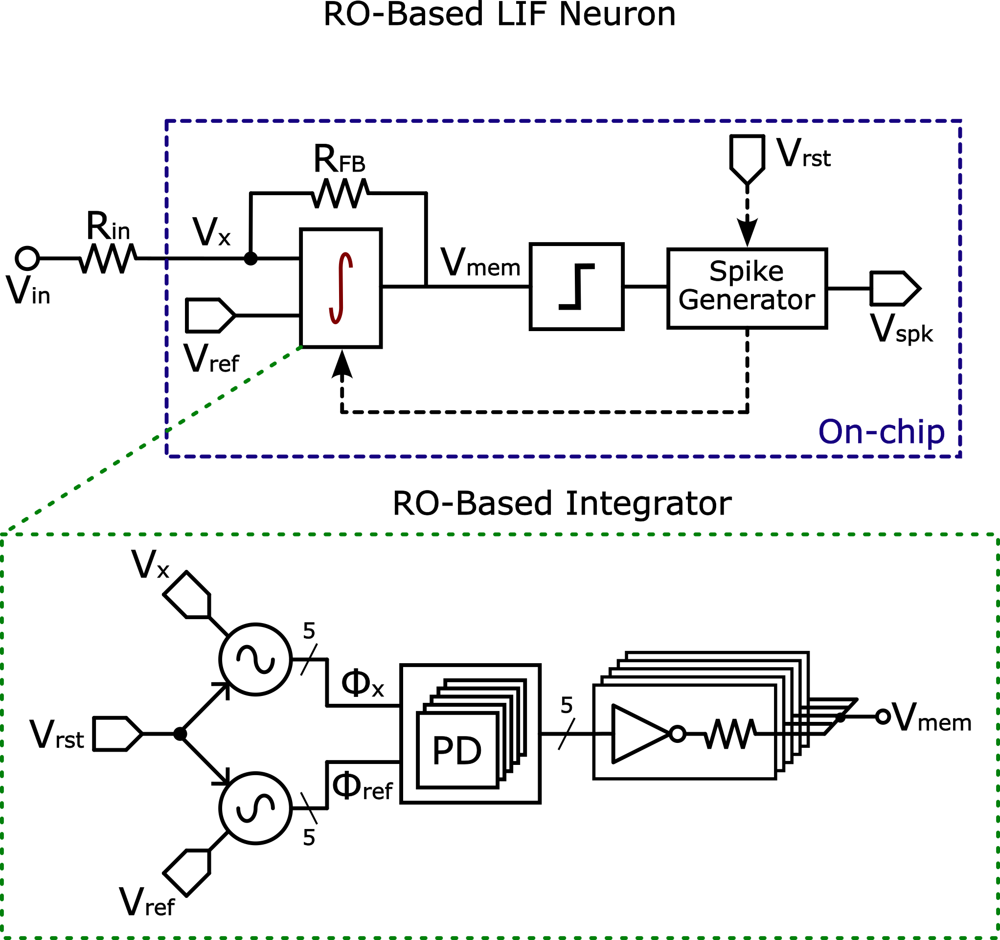

# UNIC-CASS 2025: ROI LIF Neuron
Ring oscillator based time domain integrator for a leaky integrate and fire spiking neuron for UNIC-CASS 2025.

## Team Members:

- Jorge Angarita (M)
- Juan Luengas (B)
- Nicolás Velasco (B)
- Michel Salazar (B)
- Carlos Álvarez (B)

## Team background
### Academic Experience:
- (M): MSc in EE Student at UIS
- (B): BSc in EE Student at UIS
- 
This project proposes the integration of a modular spiking neuron for implementation in MOSbius, targeting the 2025 Chipathon. The proposed architecture uses a low-pass filter realized via a time-domain integrator based on a ring-oscillator VCO, in addition to a comparator and an output spike generation circuit, just as shown in the figure below:

